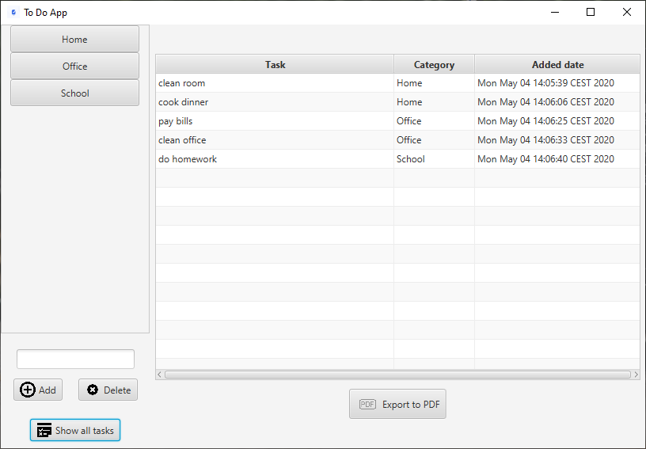
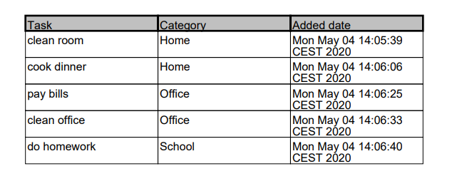

# To Do App
**Simple To Do App created with Java 14, JavaFX 11 and H2 Database**
## Table of contents
* [General info](#general-info)
* [Technologies](#technologies)
* [Setup](#setup)
* [Features](#features)
* [Author](#author)
* [Screenshots](#screenshots)

## General info
This project is simple To Do App to menage tasks (tasks can be sorted by categories).

## Technologies
Project is created with:
* Java version: 14.0
* JavaFX version: 11.0
* H2 Database version: 1.4.200

## Setup
To open and run this project, download this respository to one folder and then open folder using e.g. [IntelliJ](https://www.jetbrains.com/idea/), then run Main class.

## Features
* Add/Delete new category
* Add/Delete/Edit task in category
* Edit selected task
* Browse exist tasks in database
* Ability to export data to PDF file

## Author
* **[Karol Wlazło](https://github.com/wlazlok
)**
* **email:** kwlazo9@gmail.com

## Screenshots

